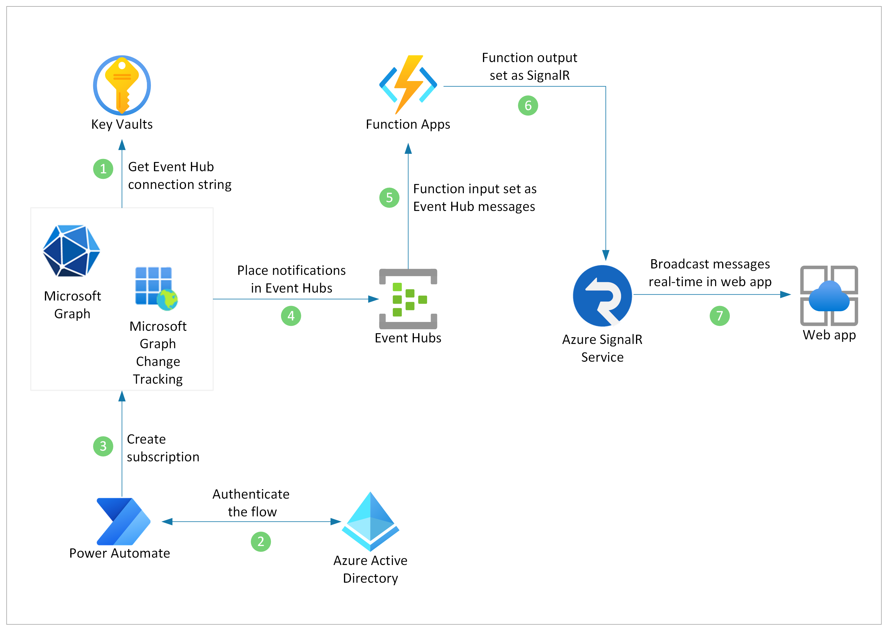

# Lets Brainstorm

Brainstorm is an example of using the Fluid Framework to build a collaborative line of business application. In this example each user can create their own sticky notes that is managed on a board. Ideas that have been "liked" appear
in a list and are sorted based upon the number likes. 

Microsoft Graph functionality is also integrated in the `m365` branch to display user profiles and integrate user presence.

## Integrating real-time presence change notifications 

The Brainstorm app receives the Microsoft Graph Change Notifications though Azure Event Hubs. To receive presence changes in real-time, Azure Functions and SignalR Service are communicating with Azure Event Hubs.

 

### 1. Set up Azure Event Hubs and Azure KeyVault
 
To get [Microsoft Graph Presence](https://docs.microsoft.com/graph/api/presence-get?view=graph-rest-1.0&tabs=http&WT.mc_id=m365-37017-aycabas) change notifications delivered through Azure Event Hubs, setup Azure Event Hubs and Azure KeyVault by following the documentation: [Using Azure Event Hubs to receive change notifications](https://docs.microsoft.com/graph/change-notifications-delivery?WT.mc_id=m365-37017-aycabas#using-azure-event-hubs-to-receive-change-notifications)

**Notification Url** is created in this step as following and will be used in *Create a flow to execute subscription* step:
`EventHub:https://<azurekeyvaultname>.vault.azure.net/secrets/<secretname>?tenantId=<tenantId>`

### 2. Create subscription using Power Automate

A Power Automate flow and a custom connector is used to create subscription for Microsoft Graph Presence Change Notifications. 

#### Register an app in Azure Active Directory

To register an app follow the steps below:

1. Sign in to the [Azure portal](https://portal.azure.com), select Azure Active Directory from the menu on the left.
1. Select **App registrations** tab, select **New registration** to register a new app and fill the details as following:
    - Name: *Presence Subscription*
    - Supported account types: *Accounts in any organizational directory (Any Azure AD directory - Multitenant) and personal Microsoft accounts (e.g. Skype, Xbox)*
    - Redirect URI type: *Web* and URI: *https://global.consent.azure-apim.net/redirect*
    - Select **Create**.
1. Select **Authentication** tab, enable `Access tokens` & `ID tokens` and **Save**.
1. Select **API permissions** tab, select **Add a permission**, choose *Microsoft Graph* and *Delegated Permissions*, add `Presence.Read`, `Presence.Read.All` in the app permissions.
1. Select **Certificates & Secrets** tab, select **New client secret** and copy the `Client Secret`.
1. Select **Overview** tab, copy `Application (client) ID`.

#### Create a custom connector for Microsoft Graph Subscription API

1. Visit [Power Automate Portal](https://flow.microsoft.com), select **Data** tab and **Custom connectors**.
1. Select **New custom connector** and **Import an OpenAPI file**, name your custom connector as `Subscription` and import `Subscription.swagger.json` file under **M365SubscriptionFlow** folder in Brainstorm app.
1. In the custom connector page, navigate to **2. Security** tab and paste your Azure Active Directory app `Application (client) ID` and `Client Secret`. Add *https://graph.microsoft.com* as **Resource URL**.
1. Select **Create connector**.

#### Create a flow to execute subscription

To create and run the subscription flow on Power Automate, follow the steps below:

1. In Power Automate Portal, select **Data** and **Connections**, select **Create a new connection**. Search for for your *Subscription* custom connector and select plus button to create connection. Repeat the same process to create new connections with *Microsoft Teams* and *Azure AD* connectors. 
1. Select **My flows** and **Import**.
1. Select `PresenceSubscriptionFlow.zip` file under **M365SubscriptionFlow** folder in Brainstorm app.
1. In the import package page, configure import setup for resource types by following the steps below:
    - *Flow*: change import setup from Update to `Create as new`.
    - *Connector*: click on **Select during import**, choose **Subscription** custom connector listed and **Save**.
    - *Subscription Connection*, *Microsoft Teams Connection* and *Azure AD Connection*: click on **Select during import**, select your connection from the list and **Save**.
1. Select **Import**.
1. Navigate to **My flows** tab in Power Automate Portal, select your *Presence Custom Connector Flow* and edit.
1. Select *Get a team* operation in the flow, remove the id in the field and select a preferred team from the list. Flow will create Presence Change Notification subscription for the selected team members.
1. Select *Subscription* operation in the flow, replace `notificationUrl` with your **Notification Url** created previously in *Set up Azure Event Hubs and Azure KeyVault* step.
1. **Save** and **Test** your flow. Presence changes for any member of the selected team can be monitored using Azure Event Hubs Dashboard. Alternatively, Visual Studio Code [Azure Event Hubs Explorer Extension](https://marketplace.visualstudio.com/items?itemName=Summer.azure-event-hub-explorer&WT.mc_id=m365-37017-aycabas) can be used for event monitoring.  

### 3. Receive real-time change notifications in your app

Brainstorm app uses Azure SignalR Service and Azure Functions to receive Microsoft Graph Presence Change Notifications in real-time.

#### Configure Azure SignalR Service

Set up SignalR Service on Azure by following the documentation: [Create an Azure SignalR Service instance](https://docs.microsoft.com/azure/azure-signalr/signalr-quickstart-azure-functions-javascript?WT.mc_id=m365-37017-aycabas#create-an-azure-signalr-service-instance).

Once SignalR Service is deployed on Azure, navigate to your SignalR Service in the Azure Portal and select **Keys** tab. Copy connection string that will be used in the next step.

#### Setup the Functions locally

To setup and run the functions locally, follow the steps below:

1. Navigate to *SignalRConnection.tsx* file under the **src** folder of the project and replace `apiBaseUrl` with `http://localhost:7071/api`.
1. Create `local.settings.json` file under the *EventHubsFunctions* folder of the project and paste the following script:
    ```json
    {
    "IsEncrypted": false,
    "Values": {
    "FUNCTIONS_WORKER_RUNTIME": "node",
    "AzureWebJobsStorage": "UseDevelopmentStorage=true",
    "AzureSignalRConnectionString": "SignalR-Connection-String",
    "AzureEventHubConnectionString": "EventHub-Connection-String"
    },
        "Host": {
        "CORS": "http://localhost:3000",
        "CORSCredentials": true
        }
    }
    ```

1. Replace `AzureSignalRConnectionString`, `AzureEventHubConnectionString` and `AzureWebJobsStorage` with your own connection strings.
1. Open a terminal window at the *EventHubsFunctions* folder of the project.
1. Run `npm install` and then `func start` from the *EventHubsFunctions* folder.

> **Note:** SignalR binding needs Azure Storage, but you can use local storage emulator when the Function is running locally. Please download and enable [Storage Emulator](https://docs.microsoft.com/azure/storage/common/storage-use-emulator?WT.mc_id=m365-37017-aycabas) to run the Functions locally.


## Running the App Locally 

Follow the steps below to run this in local mode (Azure local service):

1. Run `npm install` from the brainstorm folder root
1. Run `npx @fluidframework/azure-local-service@latest` to start the Azure local service for testing and development
1. Run `npm run start` to start the client
1. Navigate to `http://localhost:3000` in a browser tab

📝 NOTE

Azure local service is a local, self-contained test service. Running `npx @fluidframework/azure-local-service@latest` from your terminal window will launch the Azure local server. The server will need to be started first in order to provide the ordering and storage requirement of the Fluid runtime.

## Running the App Locally with Azure Relay Service as the Fluid Service

To run this follow the steps below:

1. Go to the Azure portal and search for `Fluid Relay`.
1. Create a new Azure Fluid Relay resource and note the `Tenant Id`, `Primary key`, and `Orderer Endpoint` and `Storage Endpoint` values.
1. Rename the `.env-template` file in the root of the project to `.env`.
1. Replace the values in the `.env` file with the appropriate values from the Azure portal.
1. Open a terminal window at the root of the project.
1. Run `npm install` from the root
1. Run `export REACT_APP_FLUID_CLIENT=useAzure` in the terminal to create an environment variable (if using PowerShell run `$env:REACT_APP_FLUID_CLIENT='useAzure'`). This will cause the app to use Fluid Relay service instead of `azure-local-service` for the Fluid relay service.
)
1. Run `npm start` to start the client
1. Navigate to `http://localhost:3000` in a browser tab

## Using the Brainstorm App

1. Navigate to `http://localhost:3000`

    You'll be taken to a url similar to 'http://localhost:3000/**#a9c16d13-43fa-413a-859c-514e5bcaba3c**' the path `#a9c16d13-43fa-413a-859c-514e5bcaba3c` specifies one brainstorm document.

2. Create another chrome tab with `http://localhost:3000/**#a9c16d13-43fa-413a-859c-514e5bcaba3c**`

    Now you can create notes, write text, change colors and more!